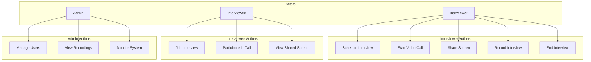

# Video Calling Interview Platform - System Design

## System Overview
The Video Calling Interview Platform is a web-based application that enables video interviews with features like screen sharing, recording, and real-time collaboration. The system is built using Next.js, TypeScript, Stream for video calls, Convex for backend, and Clerk for authentication.

## 1. Class Diagram

## 2. Use Case Diagram

## 3. Activity Diagram

## 4. Entity Relationship Diagram

## System Components

### Frontend (Next.js)
- User Interface Components
- Video Call Interface
- Authentication Pages
- Dashboard
- Interview Management

### Backend (Convex)
- User Management
- Interview Scheduling
- Video Call Management
- Recording Storage
- Real-time Updates

### External Services
- Stream (Video Calls)
- Clerk (Authentication)
- Storage (Recordings)

## Data Flow
1. User authentication through Clerk
2. Interview scheduling and management
3. Video call initiation through Stream
4. Real-time communication
5. Recording storage and management
6. Post-interview analytics and review

## Security Considerations
- End-to-end encryption for video calls
- Role-based access control
- Secure storage of recordings
- Authentication and authorization
- Data privacy compliance
